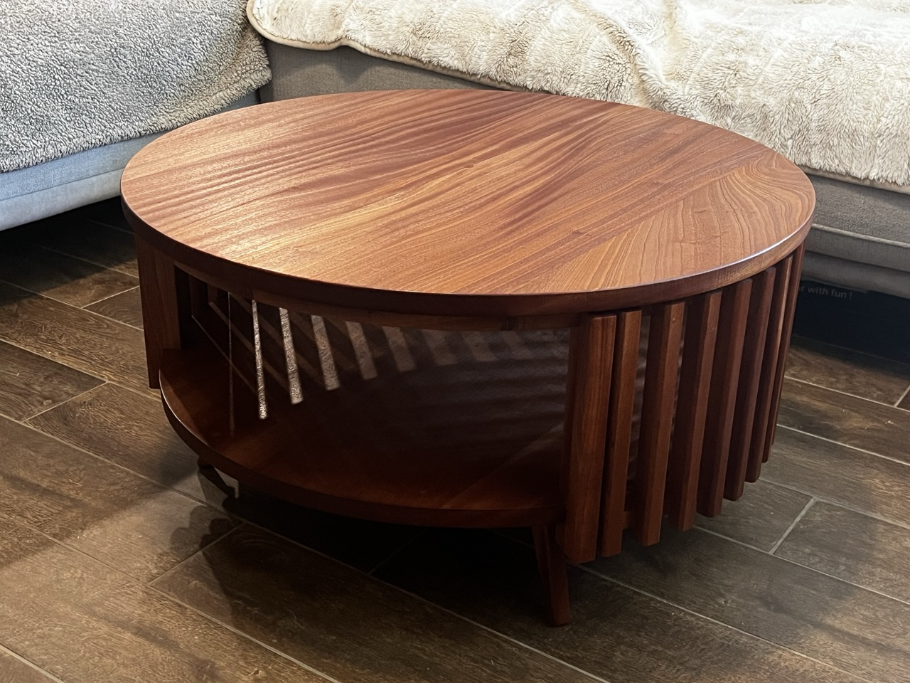
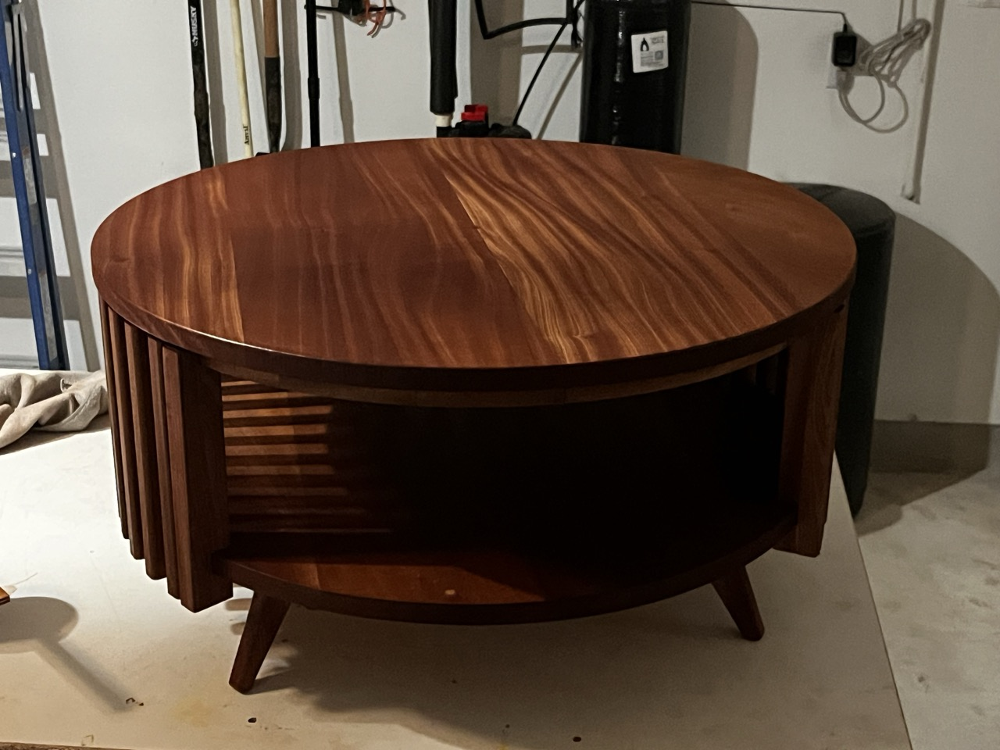

# Projects, but not software ones

<h2 id="subtitle">Here you'll find stuff I made without writing code. If you want code... go look at my actual Github 🙃</h2>

## Coffee table in sapele

This coffee table is my interpretation of one my wife found online. I
enjoyed figuring out how to make the little details work... the tiny
reveal between the vertical slats and the table top, the understructure,
and cutting the perfect circles.

Sapele is a rich, beautiful wood, and I hope to use it for many future
projects. The dust is a tad spicy, so don't skip the dust mask when you
work with it.

  
  

### Understructure

Supporting the table is an angled cross-lap with tapered feet joined in
with half-laps.

  <image src="./assets/coffee-table/04.jpeg" />
  <image src="./assets/coffee-table/05.jpeg" />
  <image src="./assets/coffee-table/03.jpeg" />
  <image src="./assets/coffee-table/08.jpeg" />

### Vertical supports

I chopped these to length and taped them together in groups of 7 to cut
the saddle joints on the table saw.

  <image src="./assets/coffee-table/06.jpeg" />
  <image src="./assets/coffee-table/07.jpeg" />

### Plenty of storage

I love how much we can stash under this thing. This was right before the
finish went on. I used Seal-a-cell with an Arm-r-seal topcoat. This is
piece is puppy-approved!

<image src="./assets/coffee-table/11.jpeg" />

## Mudroom with walnut bench

This space in our house was super bare, but adding this mudroom really
gave it some life.

  <image src="./assets/mudroom/01.jpeg" />
  <image src="./assets/mudroom/07.jpeg" />

Starting from the ground up, I built the carcass then installed the
tongue and groove panels.

  <image src="./assets/mudroom/02.jpeg" />
  <image src="./assets/mudroom/03.jpeg" />

Next, I hung the cabinet with a French cleat and threw on a coat of
primer. And after that... well, look up above at the result!

  <image src="./assets/mudroom/05.jpeg" />
  <image src="./assets/mudroom/06.jpeg" />

## Restoring the crusty cargo van

What do you do when you're driving down the street on a rainy Friday night and you see a nasty old cargo van, most of its paint missing, sitting with the words "FOR SALE" scrawled across the side?

Easy. You buy it. Well, first you talk to your spouse and convince them that you're not insane... then you buy it!

<image src="./assets/van/01.jpeg" width="400" />

I had wanted a cargo van for a while because I quickly found that strapping plywood on top of my SUV was untenable. The best I could come up with was a couple 8-foot 2x4's running long-ways screwed into 2x4 cross pieces. A couple upright pieces at the front helped prevent things from flying forward and destroying cars in front of me at stop lights. I used u-bolts to attach the geddup to my roof rails, and it was a massive inconvenience.

I could only carry 2 or 3 sheets at a time, had to take slow back roads, tons of time lost to strapping down and later unloading... the list goes on. I did what I had to, but the thought of cranking out future projects that require a ton of sheet goods felt super daunting without proper hauling equipment.

So what's the solution? A lot of people would say a pickup truck, but those honestly are not as useful as people pretend. Most don't have an 8-foot bed, and even if they do, it leaves your sheet goods exposed. And without a full 8-foot bed, you're still stuck in strap-down hell just like with the roof rack. That, or you get an 8-foot trailer. Then you're in trailer hell.

But a cargo van is heaven. 10 feet of bed space, fully enclosed, low loading height, still the size of a (hefty) pickup truck.

<image class="centered" src="./assets/van/02.jpeg"  />

Obviously, this one was a fixer-upper. I got an amazing price for it, but from there it was off to the interwebs to figure out how to fix all sorts of things on it.

Here's everything I can remember:

- Change vent solenoid
- Change purge solenoid
- Replace all 4 shocks
- New headlights and wiper blades
- Oil change
- Engine air filter
- Bondo over some dents
- Check fuses and replace a couple
- Deep clean everything. It was a spice delivery van for 15 years and caked in cumin.
- Replace bed liner
- Change spark plugs
- Replace seat foam and upholstery
- Fix turn signals and wiring; one of them had melted before I bought it
- Replace headliner
- Install hard insulation throughout
- Tint windows
- Replace rear view mirror
- Install aftermarket stereo with backup camera
- Fix the seatbelt clicker when it flew apart
- Replace AC vacuum hose
- Replace battery
- Strip off as much old paint as possible, spray some primer
- Wrap it! HUGE shoutout to [@technician_gus] for helping me out
- Black out rims

  <image src="./assets/van/05.jpeg" />
  <image src="./assets/van/06.jpeg" />
  <image src="./assets/van/11.jpeg" />
  <image src="./assets/van/07.jpeg" />

<image src="./assets/van/10.jpeg" />

Plywood and lumberyard runs in this thing are an absolute dream. Seriously so easy. I also drove it halfway across the country to pick up some machines. Had an amazing time sleeping in the back of it at a truck stop in New Mexico. I'm keeping this thing forever!

## Standup paddle board

_Don't get your hopes up for this one_

Yes, I did make a paddle baord, BUT... I made a ton of mistakes, and the result was unfortunately a failure. I did take it out on the lake once, however, and it floated. I learned a lot from this one and I would be really excited to try this again with a little more experience.

I based my design loosely on [The Wombat] from Vintage Board Co.

### The innards

Wooden paddle boards are built with horizontal ribs and long vertical stringers. These are stitched to the bottom of the board and glued in with epoxy.

  <image src="./assets/sup/01.jpeg" />
  <image src="./assets/sup/02.jpeg" />

Next, the sides are bent around the ribs and also stitched and glued with epoxy. At this point, the hull starts to take shape and you can believe that this thing might actually become a boat.

<image src="./assets/sup/03.jpeg" />

## Glassing

Boards have three really critical structural requirements:

1. Waterproof
2. Airtight
3. Won't collapse / not easily destroyed

Coating the thing in fiberglass and epoxy theoretically fulfills these requirements. It's a very common step for making wooden watercraft usable.

Once both sides are glassed, I added the finishing touches with rigging, a handle, and grippy strips to make it into a real paddle board.

  <image src="./assets/sup/04.jpeg" />
  <image src="./assets/sup/05.jpeg" />

## Result

Like I said, this thing did float, so... mission accomplished?

  <image src="./assets/sup/06.jpeg"  width="400"/>
  <image src="./assets/sup/07.jpeg"  width="200"/>

Unfortunately, not mission accomplished. The mistakes that doomed this project:

**Choice of materials**
My plywood was twice the correct thickness (1/4" instead of 1/8"), and to top it off, I used crappy sheathing grade plywood from the Big Orange store instead of proper plywood. That stuff is insanely heavy and full of voids.

I estimate that my poor choice of plywood tripled the weight of the board. It weighed a whopping 82 pounds, which is just too heavy. Horrible to haul that around and drags around the water like it's pulling an anchor.

**Choice of fiberglass**
The fiberglass I bought was the wrong stuff for the job. Too thick and heavy overall, but also had too much space between the weave. I should have used surfboard fiberglass (I think it's called e-glass?) but I just grabbed some stuff from Bezos' place that seemed like it would work. Well, it didn't. Should have done more research.

Because of my bad fiberglass, I had to use way more epoxy on the outside than I would have otherwise, and even then I probably didn't use enough because large patches didn't adhere properly to the board. So it failed to meet the critical requirements of the boat: not waterproof, no structural benefit. Just a waste of material.

So, since it was too heavy for me to reasonably lift and since it never recovered from getting just a little bit of water in it on its maiden voyage, I eventually chopped the thing up and tossed it. Not worth saving. I do think the experience of building the thing was worth it though, and I really do want to try again with proper 1/8" birch plywood and surfboard fiberglass. Maybe I can even get my brother to laser cut the components, that would be even better!

[The Wombat]: https://www.vintageboardco.com.au/products/wombat-diy-plywood-paddle-board-plans-full-size-tempates
[@technician_gus]: https://www.instagram.com/technician_gus/
